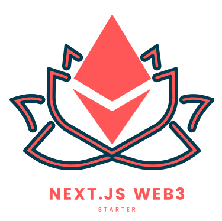

<p align="center"></p>
<h2 align="center">Next.js Web3 template</h2>

<p align="center"><b>🏗️ Next.js + Material UI + dark mode + web3 starter template ⚡</b></p>

This is a starter boilerplate Ethereum dapp using Next.js and material UI with dark mode. There are many web3 template available but most of them depends of web3-react. I tried to use minimum dependencies possible.

### Quick start

The first things you need to do is clone repo.

To compile and deploy contract

```bash
cd deploy
npm i
npm start
```

Run the client on base directory

```bash
yarn install
yarn run dev
```

#### Project Structure

```
├── contracts          // All solidity files
│    ├── Example.sol
├── deploy
│    ├── compile.js    // compiles contracts
│    ├── deploy.js     // deploy and get abi and bytecode
│    ├── package.json
├── pages              // All pages of nextjs
│    ├── _app.js
│    ├── _documesnt.js
├── public             // contains static files
│    ├── img
│    ├── icons
├── src
│    ├── contracts     // here we store abi and bytecodes of contracts
│    ├── components    // react components
│    ├── hooks         // web and imp hooks
│    ├── utils         // theme and other lib files
├── .env
├── .gitignore
├── package.json
└── README.md
```
